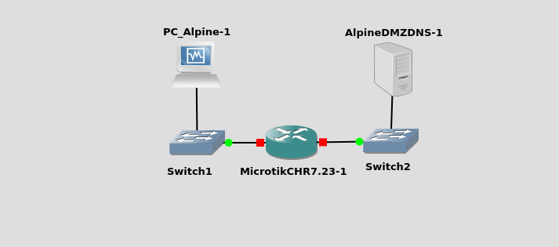

# Вторая лабораторная работа

Эта работа продолжает [Первую лабораторную работу](./First.md): тот же MikroTik связывает две подсети. Во второй подсети появляется DNS-сервер на **Alpine Linux**, а клиенты обращаются к нему по доменному имени.

**Цель:** после настройки DNS в DMZ проверить разрешение имён из клиентской сети.

**Теория:** [Теоретический конспект ко второй лабораторной](../Notes/Теоретический%20конспект%20ко%20второй%20лабораторной.md).

Гипервизор — **VirtualBox**.

### Общий план

Сеть состоит из двух сегментов и маршрутизатора между ними.

| Сеть | Роль | Устройства | Задача |
| :--- | :--- | :--- | :--- |
| **blue.net** | Клиентская | Tiny Core (PC1, PC2) | Отправлять DNS-запросы и получать IP по имени |
| **red.net** | DMZ / серверная | Alpine + BIND9 | Авторитативный DNS для зоны `lab.local` |
| — | Маршрутизация | MikroTik RouterOS | Связать `blue.net` и `red.net` (настройка знакома по первой работе) |

Почему так:

* Клиенты и сервер в **разных подсетях** — как в реальной сети: сервисы выносят в отдельный сегмент (DMZ).
* MikroTik на **сетевом уровне (L3)** пересылает пакеты между подсетями.
* DNS — сервис **прикладного уровня**: имя ↔ IP. Без него удобно работать только с адресами вроде `172.16.20.53`.

### Шаг 1: Настройка рабочих станций

Скачайте любой дистрибутив Linux, например alpine. Создайте в Virtualbox новую виртуальную машину. 
В качестве образа выставьте скачанный .iso файл. После загрузки системы с оптического диска запустите команду setup-alpine.
В wizard установки выберите язык us, все остальные параметры по умолчанию. На этапе выбора диска, вводим sda, раздел sys, соглашаемся на очистку диска и установку. В завершении появится надпись completly installed.

### Шаг 2: Сборка топологии в GNS3


```text
[Alpine PC]  → Switch1 → ether1 (MikroTik) — blue.net (CLient Zone)
[Alpine DNS] → Switch2 → ether2 (MikroTik) — red.net  (DMZ)
```
* **План адресации** (те же подсети, что в первой лабораторной):

| Сеть | Подсеть | Устройство | IP-адрес |
| :--- | :--- | :--- | :--- |
| **blue.net** | `172.16.10.0/24` | MikroTik `ether1` | `172.16.10.254` |
| | | PC | `172.16.10.1` |
| **red.net** | `172.16.20.0/24` | MikroTik `ether2` | `172.16.20.254` |
| | | Alpine DNS | `172.16.20.53` |

Запустите узлы из GNS3. Имеет смысл подписать зоны на схеме (синий / красный) и указать CIDR подсетей.

### Шаг 3: Настройка DMZ — red.net (Alpine + BIND9)

Выполните инструкцию: **[Настройка DMZ в Alpine](./SecondLabTasks/Setup_DNS.md)**  

### Шаг 4: Настройка MikroTik

Так как blue.net подключён к ether1, а red.net — к ether2:

```routeros
/ip address
add address=172.16.10.254/24 interface=ether1 comment=blue-net
add address=172.16.20.254/24 interface=ether2 comment=red-net
```

**Проверить:**

```routeros
/ip address print
```

**Ожидаемо:**

```text
# ADDRESS           NETWORK        INTERFACE
0 172.16.10.254/24  172.16.10.0    ether1
1 172.16.20.254/24  172.16.20.0    ether2
```

**Создайте DHPC диапазон адресов для клиентов:**

```routeros
/ip pool add name=blue-pool ranges=172.16.10.10-172.16.10.200
```

**Создайте DHCP сервер**

```routeros
/ip dhcp-server add interface=ether1 address-pool=blue-pool disabled=no lease-time=10m
```

**Настройте DHCP подсеть (blue.net)**

```routeros
/ip dhcp-server network add address=172.16.10.0/24 gateway=172.16.10.254 dns-server=172.16.20.53 comment=blue-net
```

**Проверьте настройку**
```routeros
/ip dhcp-server print
/ip dhcp-server network print
/ip pool print
```

MikroTik по умолчанию не пересылает DNS-запросы между своими интерфейсами. Нужно разрешить ему обрабатывать удалённые запросы:

```routeros
/ip dns set allow-remote-requests=yes
```

Без этой опции MikroTik просто игнорирует DNS-трафик от клиентов, даже если маршрутизация между blue.net и red.net настроена

**Настройка пересылки для зоны lab.local**

Теперь нужно сказать MikroTik, чтобы он перенаправлял запросы именно к lab.local на ваш BIND-сервер, а не пытался разрешить их сам.

```routeros
/ip dns forwarders add name=lab-dns dns-servers=172.16.20.53

/ip dns static add name=lab.local type=FWD forward-to=lab-dns match-subdomain=yes
```

**Пояснения:**

- type=FWD — запись типа forward.
- forward-to=172.16.20.53 — указываем прямой IP BIND, а не имя forwarder'а (надёжнее).
- match-subdomain=yes — запросы к ns1.lab.local, www.lab.local тоже уйдут на BIND, а не только сам lab.local.

Параметр `match-subdomain=yes` важен: он заставляет MikroTik перенаправлять не только запросы к `lab.local`, но и ко всем поддоменам вроде `ns1.lab.local` или `www.lab.local`

**Проверка**

```routeros
/ip dns print
/ip dns static print detail
/ip dns forwarders print
```

### Шаг 5: Настройка клиентов - blue.net (Alpine) **PC1** и **PC2**

Перезапустите сетевую службу, чтобы получить новую конфигурацию от dhcp сервера:

```bash
rc-service networking restart
```
**Проверка конфигурации**

Убедитесь, что IP и маршрут по умолчанию настроены верно:

```bash
ip addr show eth0
ip route show
```

**Проверка DNS (red.net) с клиента (blue.net)**

Установка утилит: В Alpine dig не входит в базовую поставку. Установите его из пакета bind-tools. При установке в виртуальную машину убедитесь, что тип подключения выбран "Сетевой мост", вместо "Унивесальный драйвер".

```bash
apk add bind-tools
```

```bash
ping -c 3 ns1.lab.local
# Прямой запрос (A-запись)
dig ns1.lab.local @172.16.20.53
dig www.lab.local @172.16.20.53
# Обратный запрос (PTR-запись)
dig -x 172.16.20.53 @172.16.20.53
```

### Шаг 6: Firewall на MikroTik (blue.net ↔ red.net)

Идея DMZ: из **blue.net** к DNS в **red.net** — порт 53; из **red.net** в **blue.net** инициация соединений запрещена.

Выполните полностью инструкцию: **[Настройка Firewall](./SecondLabTasks/Setup_Firewall.md)**  
(цепочки filter, правила `forward`, проверка `nslookup` / счётчики).

Краткий минимум (если инструкцию уже освоили):

```text
/ip firewall filter add chain=forward action=accept connection-state=established,related comment="Allow established/related"
/ip firewall filter add chain=forward action=accept protocol=udp src-address=172.16.10.0/24 dst-address=172.16.20.53 dst-port=53 comment="DNS UDP blue->red"
/ip firewall filter add chain=forward action=accept protocol=tcp src-address=172.16.10.0/24 dst-address=172.16.20.53 dst-port=53 comment="DNS TCP blue->red"
/ip firewall filter add chain=forward action=accept protocol=icmp src-address=172.16.10.0/24 dst-address=172.16.20.0/24 comment="ICMP blue->red for lab checks"
/ip firewall filter add chain=forward action=drop src-address=172.16.20.0/24 dst-address=172.16.10.0/24 comment="Block red->blue"
```

Проверка: `/ip firewall filter print`. Порядок: сначала accept, затем drop.

### Готово

Если клиент из **blue.net** получает IP по имени `www.lab.local` от сервера в **red.net**, лабораторная выполнена.

### Домашнее задание

Сдать к следующей встрече:

1. Вывод `nslookup` или `dig` для `www.lab.local` (с указанием сервера `172.16.20.53`), где виден ответ с IP.
2. Кратко (3–5 предложений): чем запись **A** отличается от **PTR**; зачем сервер DNS вынесен в **red.net** (DMZ), а клиенты — в **blue.net**.
3. Одним абзацем своими словами: смысл одного правила firewall из [Настройка Firewall](../Theory/Настройка%20Firewall.md) (например, разрешение UDP/53 blue→DNS, `established,related` или запрет red→blue).
